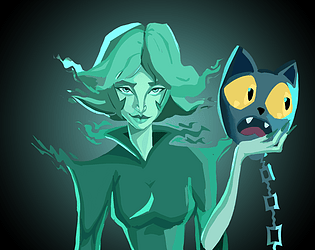

# 💫 About Me

👤 About Me

 

<h1 align="center">Hi, I'm Kawish 👋</h1>

  Software Engineering student at <b>Hogeschool Rotterdam</b> 
  Technical Director at <b>Glorporation Games</b> 
  Currently building our first <b>multiplayer game</b> 🎮

---

## 👤 Who I Am

- 💻 Studying Informatica and developing solid software engineering fundamentals  
- 🎮 Technical Lead of the development team at Glorporation Games  
- 🧩 Designing and implementing gameplay systems and tools that are scalable, maintainable, and fun to use  

---

## 🚀 What I am curently doing

- Creating core systems and gameplay for our first multiplayer game: <b>Truckin' It</b>  
- Creating tools for non-technical teammates to further help the game's development  
- Making technical decisions and supporting my team as Technical Director  
- Improving code quality, architecture, and collaboration every sprint  

---

## 🌐 Socials

 

---

## 💻 Tech Stack

---

🧱 What I've worked on

 

## 🎮 Move It

Upcoming

---

## 🐱 SpiritBound: Catnonball 🧙‍♀️

During my fourth-year minor we had five weeks to learn Unity and build a complete game. Together with a team of five, I worked on **SpiritBound: Catnonball**, a physics-based platformer about a witch and her cat who are trapped in Limbo.  
Their goal is to escape the depths of the realm they have fallen into and return to the normal world. The core mechanic is a slingshot-style movement system where the witch launches the cat to fly through the level, using that momentum as the main way to move and platform.

  

---

## 🗺️ Interactive Model Viewer

During my third-year internship I developed an interactive model viewer for Soltegro, a company in Capelle aan den IJssel.  
The viewer uses an SVG model of infrastructure, such as a lock chamber. Users can zoom, drag the map and click on elements to quickly get insight into what they are looking at.

For each clickable element, a foldable side panel shows the description, design decisions and all relevant information. This reduces the need to dig through nested design documents and gives insights with a single click.

I also built a workflow for uploading new models. Uploaded SVGs are validated and, if correct, automatically loaded into the application. This means developers are no longer needed to manually update models in the codebase.

  

---

📊 GitHub Stats

 

 
 

